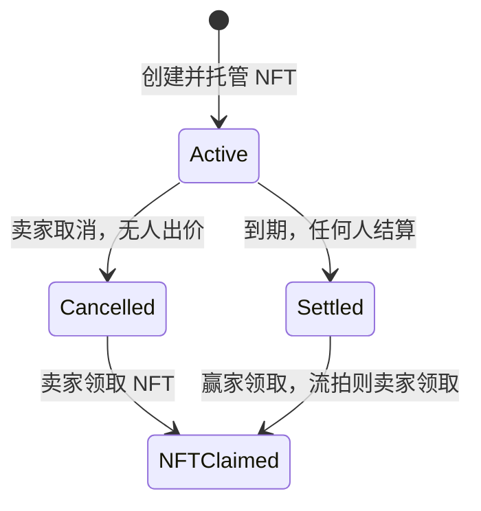

# NFT 拍卖合约

`Auction` 是通过 ERC1967Proxy 使用的 UUPS 拍卖实现。支持 ETH 和管理员配置的 ERC20，以出价时的美元估值比较价格。NFT、竞价资金和卖家收入分别记账；拍卖结算、NFT 领取和资金提现互不依赖接收方能否立即收款。

本次重构基于“尚未部署”的前提，重新定义接口与存储布局。它不是旧版本代理的兼容升级。拍卖测试通过 ERC1967Proxy 初始化项目自己的 `JunNFT`，使用其真实的铸造、授权、转移和枚举逻辑；`JunNFT.sol` 业务代码未修改。这不等于已覆盖 JunNFT 自身的全部权限、销毁与升级场景。

## 生命周期与资金



`nftClaimed` 单独记录领取状态；领取后拍卖的 `status` 仍为 `Cancelled` 或 `Settled`。

- ID 从 **1** 开始，0 表示不存在。
- `duration` 单位为**秒**，范围 `(0, 30 days]`。到期时禁止继续出价。
- `reservePriceUsd` 和美元估值均为 **18 位精度**。首次有效出价可以等于起拍价，后续出价必须严格高于前次最高美元估值。
- `placeBid` 的 `amount` 是本次追加数量；同一用户的未退资金会累加。退款前只能继续使用同一种币。
- 同一卖家不能给自己的拍卖出价。合约不能识别同一人控制的其他钱包。
- 非最高出价者随时可以退款。当前最高出价者在结算前不能退出；结算后其出价归入卖家收入，不可再次退款。
- `settleAuction` 到期后任何人可调用。只更新状态与账本，不读取价格源，也不向卖家、赢家或 NFT 合约发起调用。
- `claimNFT` 仅允许赢家或流拍/取消时的卖家指定接收地址。尚未结算时可以顺便结算；接收失败回滚该交易，但仍可另行结算并换地址领取。
- 无人出价时卖家可以取消，包括到期后。取消不自动转移 NFT。
- `totalLiabilities[token]` 等于该币种全部未退竞价款加卖家可提收入。结算只是账目转移，不改变总负债；退款/提现才减少负债。
- 合约没有管理员提走托管资金的接口。UUPS 升级权限仍能改变未来实现，因此管理员是受信任的治理角色。

## 主要接口

| 接口 | 调用者 | 含义 |
| --- | --- | --- |
| `initialize(initialOwner)` | 代理构造时执行一次 | 指定管理员；实现合约已锁定初始化 |
| `configureToken(token, feed, maxAge)` | owner | 添加或更新币种的 token/USD 价格规则 |
| `setTokenEnabled(token, enabled)` | owner | 停用/恢复该币种的新出价 |
| `pause()` / `unpause()` | owner | 暂停/恢复创建和出价，不阻塞退出 |
| `createAuction(nft, tokenId, reservePriceUsd, duration)` | NFT 持有人 | 授权代理后创建拍卖 |
| `placeBid(id, token, amount)` | 非卖家 | ETH 使用零地址，且 `msg.value == amount` |
| `cancelAuction(id)` | 卖家 | 无出价时取消 |
| `settleAuction(id)` | 任何人 | 到期结算并为卖家记账 |
| `claimNFT(id, recipient)` | NFT 权利人 | 领取至指定地址 |
| `withdrawBid(id, recipient)` | 出价者 | 领取可退竞价资金 |
| `withdrawProceeds(token, recipient)` | 卖家 | 提取该币种累计成交收入 |
| `getAuction(id)` / `getBid(id, bidder)` | 任何人 | 查询完整拍卖/竞价记录 |
| `quoteUsd(token, amount)` | 任何人 | 按当前有效 feed 报价，返回 18 位美元值 |

原有 `refound`、`endAcution`、`closeAuction`、`setPriceConfig` 已删除，分别改为 `withdrawBid`、`settleAuction`、`cancelAuction`、`configureToken`。`initialize()` 改为 `initialize(address)`。创建拍卖的持续时间由“小时数量”改为“秒数量”。事件也已统一为过去式名称，并包含拍卖 ID、支付币种、实际数量及美元估值，调用方应使用新 ABI。

## 价格与资产边界

- 只配置经核实的 **token/USD Chainlink feed 代理**。地址有代码、价格大于零并不能证明交易对正确；管理员必须核对网络、交易对、精度与 heartbeat。
- 校验价格为正、时间戳非零且不在未来、更新时间不超过 `maxAge`；feed 精度若偏离首次配置值则拒绝报价。
- owner 可再次调用 `configureToken(token, feed, maxAge)` 更换价格源或调整有效期；新配置必须通过当前价格校验，更新失败保留旧配置。更新保持币种启用状态及代币精度不变，feed 精度可以随新价格源调整，并发出 `PriceConfigured` 事件。新配置立即影响后续报价和出价，不重算已有出价的美元估值或托管数量。管理员必须保证新旧 feed 对应同一 token/USD 交易对；放宽 `maxAge` 只扩大可接受的价格年龄，不会促使预言机更新。停用、feed 中断或价格过期不会阻塞已有拍卖结算和提款。
- 美元估值取出价时的快照；不同币种价格会波动，结算仍支付原币种与原数量，没有锁定美元价值或兑换服务。
- 当前面向 Ethereum L1/Sepolia。**未实现 L2 sequencer uptime/grace-period 校验，不应不加修改地用于 L2。**
- 仅支持标准、非 rebase、无转账税的 ERC20。入账核对合约余额增量，出账同时核对付款方扣款和收款方到账。`SafeERC20` 处理返回值异常。代币后续若启用黑名单、冻结或转账税，提款可能回滚；管理员只能停止新增风险，不能绕过代币自身权限。
- 仅使用可信的标准 ERC721。ERC165/ownerOf 检查无法证明 NFT 合约不会升级、撤销所有权或恶意改变行为。NFT 托管后被外部销毁或变更所有权不在当前保证范围内。
- 拒绝与创建拍卖无关的 `safeTransferFrom`。**不要通过普通 `transferFrom` 直接发送 NFT**：该方式不触发接收检查，也不会创建可领取记录。没有通用管理员救援接口。
- 暂停不会延长拍卖时长，也不会允许最高出价者反悔。无滑动延期、平台费、版税或竞价最小增幅百分比。

价格源接口对照 [Chainlink Data Feeds API](https://docs.chain.link/data-feeds/api-reference)；初始化锁定和存储演进依据 [OpenZeppelin 升级合约说明](https://docs.openzeppelin.com/upgrades-plugins/writing-upgradeable)。

## 构建与验证

测试使用 **Sepolia 本地分叉**，固定区块 `11699475`。Solidity 测试和 Mocha 部署测试共用分叉来源；不会向 Sepolia 广播交易，不需要私钥或水龙头余额。

- 正常流程的 NFT 使用项目 `JunNFT` 代理；ETH 使用分叉环境原生币，USDC 使用 [Circle 官方 Ethereum Sepolia 地址](https://developers.circle.com/stablecoins/usdc-contract-addresses)：`0x1c7D4B196Cb0C7B01d743Fbc6116a902379C7238`（6 位精度）。
- `vm.deal` 和 forge-std 的 `deal(token, account, amount)` 只为本地账户设置测试余额，不在真实 USDC 合约上申请铸币。
- 不再部署普通支付代币。`FeeOnTransferTestToken` / `AuctionReentrantToken` 仅用于手续费和重入异常测试；价格源仍使用 mock，因此没有声称已验证真实 Chainlink feed。
- 默认从公共 RPC 读取分叉状态；可通过环境变量 `SEPOLIA_RPC_URL` 覆盖为自己的 RPC。测试需要网络访问，RPC 必须支持该固定区块的历史状态。分叉测试读取此环境变量，不读取 Hardhat keystore 中同名值。
- 需要启动可交互的本地分叉节点时，使用 `npx hardhat node --network sepoliaFork`；监听的本地节点与真实 `--network sepolia` 是两个不同环境。


```sh
npm ci
npx hardhat test --build-profile production
npx tsc --noEmit
```

默认和 production 配置均使用 solc 0.8.36、Cancun、optimizer 200 runs；构建输出包含 `storageLayout`。当前项目使用 OpenZeppelin 5.6.1 系列，`contracts-upgradeable` 已显式声明为依赖；测试按该版本的自定义错误进行断言。不要把升级基类直接换成其他主版本后覆盖已有代理。

本次验证：33 项 Solidity 测试、1 项 Mocha/Ignition 部署测试通过；资金守恒 fuzz 测试运行 256 组输入。测试涵盖权限、两步交接、非法参数、到期边界、重复结算/领取、退款、混合币种、多拍卖隔离、暂停期间退出、无效/过期 feed、转账税、ETH/ERC20 回调重入及 UUPS 原子升级初始化。测试通过升级及初始化后继续结算、提现和领取 NFT，验证已有业务状态保留；实际版本升级仍需核对编译器存储布局。

运行时代码约 14 KB，部署测试另行断言小于 EIP-170 的 24,576 字节限制。以上都是本地验证，尚未进行真实网络部署、真实 feed 集成或独立安全审计。

`npm audit --omit=dev` 本次报告 24 项传递依赖告警（4 high、5 moderate、15 low）。告警包括依赖树中旧 OpenZeppelin 副本及 `tmp`、`ws`；不能据此直接断言 Auction 字节码存在同样漏洞。未执行会跨版本改写依赖的 `npm audit fix --force`。依赖树仍需单独治理；本次没有宣称完整供应链审计通过。

## 代理部署

[ignition/modules/Auction.ts](ignition/modules/Auction.ts) 部署实现和 ERC1967Proxy，并在代理构造中原子调用 `initialize(owner)`。使用参数文件，例如自行创建 `ignition/parameters/sepolia.json`：

```json
{
  "AuctionModule": {
    "owner": "填写你的管理员或多签地址"
  }
}
```

填入实际地址并完成现有 Hardhat 网络配置后才能执行：

```sh
npx hardhat ignition deploy ignition/modules/Auction.ts --network sepolia --parameters ignition/parameters/sepolia.json
```

脚本只部署 Auction，不部署 JunNFT、不设置真实 feed，也未在本次操作中提交链上交易。部署后由 owner 配置支付币和 feed。NFT 授权、业务调用及资金查询都使用返回的 `auction` **代理地址**，不使用 `implementation`。

生产 owner 应使用经过验证的多签/治理地址；`transferOwnership(newOwner)` 后必须由对方 `acceptOwnership()`。管理员可暂停新增业务和控制升级，不能放弃所有权以免暂停后无法恢复。升级须先核对新旧编译器布局并验证迁移；有新初始化步骤时使用 `upgradeToAndCall` 原子完成。
